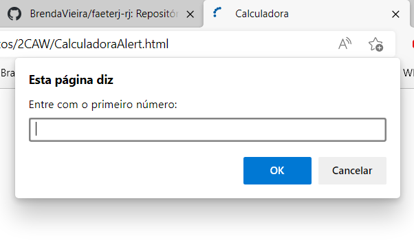

# CAW
Programas básicos e exercícios feitos nas aulas de Aplicação Web em HTML5, CSS e JS.

* Calculadora
Calculadora básica com uso de Alert()

    

	
* Calculadora Média Ponderada
Calculadora básica com uso de formulário

    

	
* Hortifrutti
Formulário

    

	
* OP?
Interface de um portal de entretenimento

    

